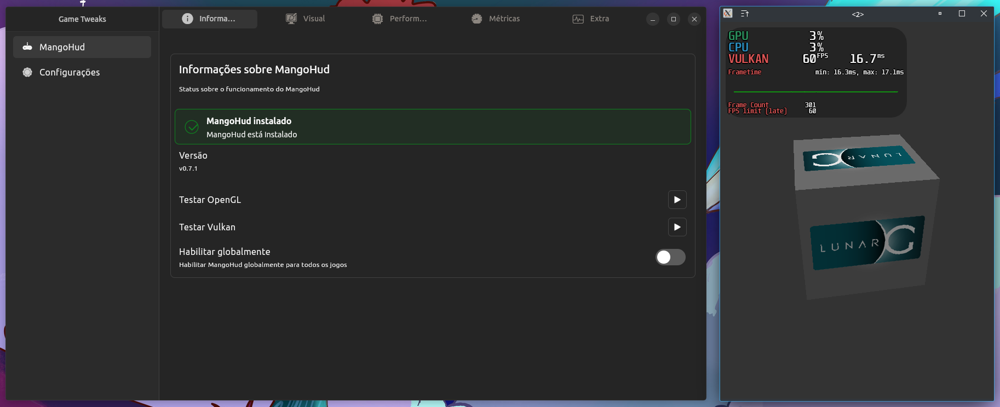
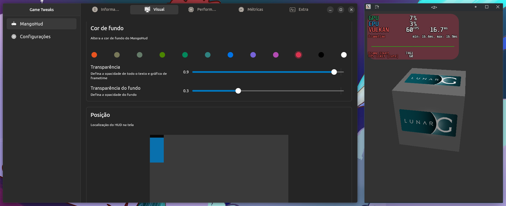
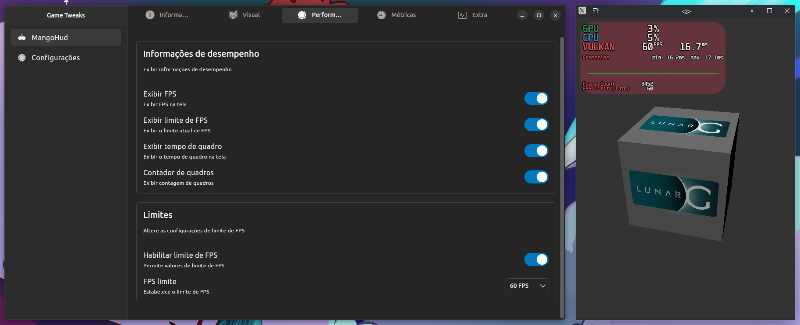
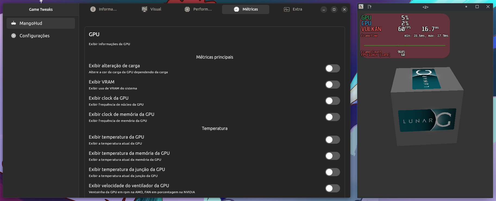
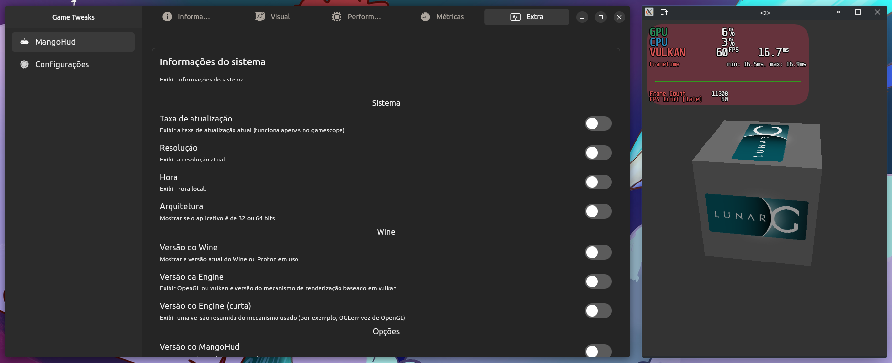
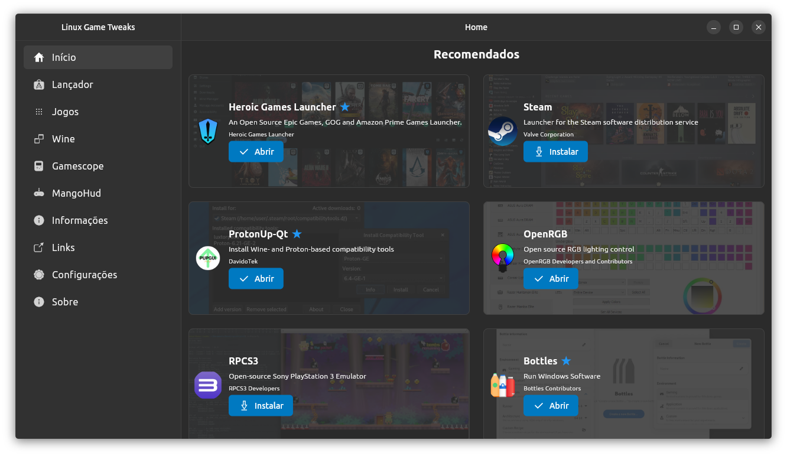
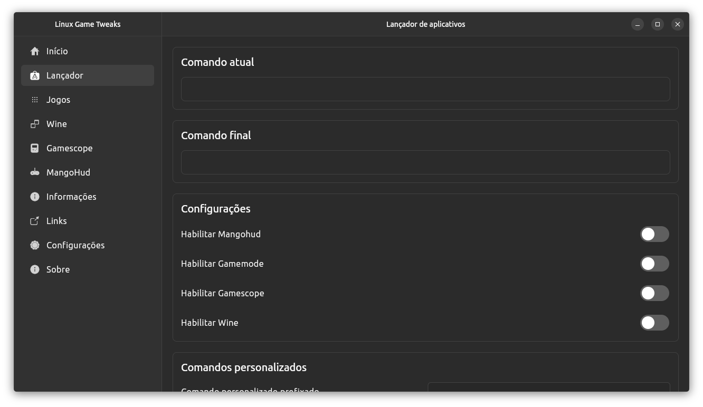
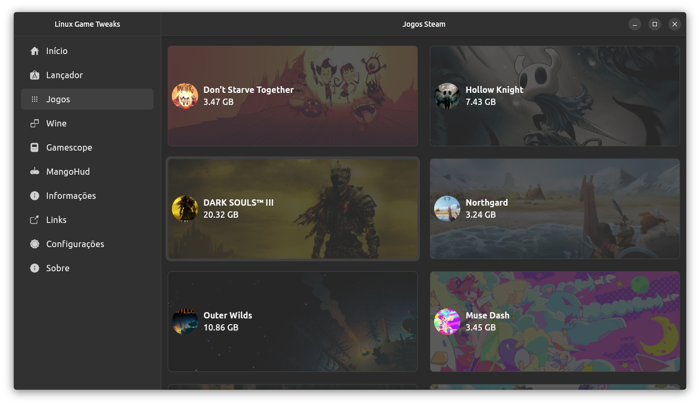
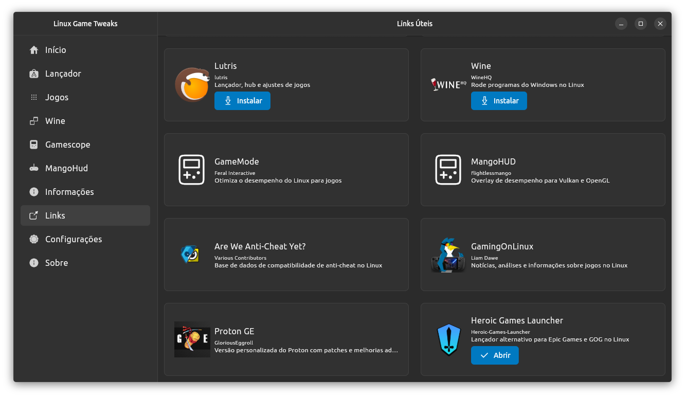
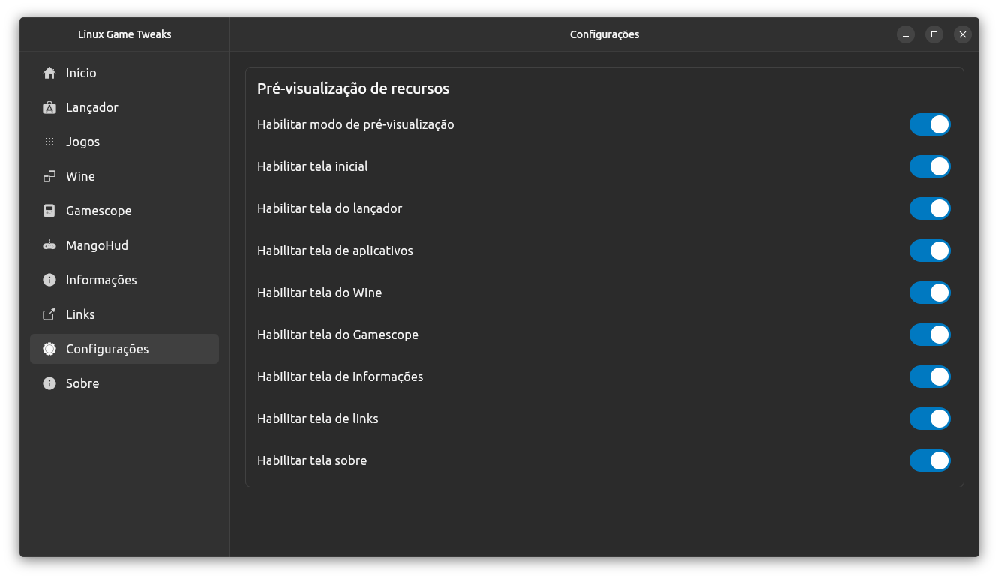

## Linux Game Tweaks

`linux_game_tweaks` é um aplicativo voltado para oferecer ajustes e facilitar o gerenciamento de jogos no Linux. Ele serve como uma central de controle para jogos, permitindo configurar, monitorar e integrar várias ferramentas e sistemas utilizados no ambiente Linux para jogos.

### Funcionalidades

- **Lançador de Aplicativos**: Execute programas com comandos personalizados e adicione parâmetros para otimização de desempenho.
- **Execução de Arquivos .exe**: Abra arquivos `.exe` diretamente pelo aplicativo ou por linha de comando.
- **Integração com Ferramentas de Performance**:
  - **MangoHud**: Monitoramento de performance em tempo real.
  - **GameMode** e **GameScope**: Ajustes de performance e configurações de janelas.
- **Gerenciamento de Aplicativos**: Suporte para instalação e gerenciamento de aplicativos Snap e Flatpak.
- **Informações do Sistema**: Visualize dados detalhados de hardware e software do sistema.

### Status Atual

O projeto ainda está em fase inicial. As telas já funcionais incluem:

- **Lançador**
- **MangoHud**
- **Configurações**

### Tecnologias Utilizadas

- **Flutter/Dart**
- Planejado para distribuição via Snap, Flatpak, AppImage e possivelmente AUR.
	- [ ] Snap
	- [ ] [Flatpak](https://github.com/pedroermarinho/io.github.pedroermarinho.linux_game_tweaks)
	- [x] AppImage
	- [ ] AUR
	- [ ] Deb
	- [ ] RPM
	- [x] Zip

---

## Passo a Passo para Rodar o Projeto

### Pré-requisitos

1. **Instale o Flutter e o Dart**:

   - Siga as instruções no [site oficial do Flutter](https://flutter.dev/docs/get-started/install) para instalar o SDK do Flutter no seu sistema.
   - Certifique-se de que o Dart esteja disponível como parte do Flutter SDK.

2. **Clone o Repositório**:

   ```bash
   git clone https://github.com/seu-usuario/linux_game_tweaks.git
   cd linux_game_tweaks
   ```

3. **Instale as Dependências**:
   Dentro do diretório do projeto, execute:

   ```bash
   flutter pub get
   ```

4. **Compile e Execute o Projeto**:
   Para rodar o aplicativo em modo de desenvolvimento, utilize:
   ```bash
   flutter run
   ```

### Comandos Úteis

- **Atualizar Arquivos de Internacionalização (i18n)**:

  ```bash
  dart run intl_utils:generate
  ```

- **Aplicar Correções Automáticas**:

  ```bash
  dart fix --apply
  ```

- **Formatar Código**:

  ```bash
  dart format .
  ```

- **Gerar de Código Automático**:

  ```bash
  dart run build_runner watch
  ```


### Distribuição do Aplicativo

### Para criar uma versão para distribuição em ambiente Linux:

```bash
flutter build linux --release
```

### Para criar em paconte AppImage e zip:
#### Requisitos
- [Flutter](https://flutter.dev/docs/get-started/install)
- [Flutter Distributor](https://distributor.leanflutter.dev/)
- locate
  - Debian/Ubuntu
    ```bash
      sudo apt install locate
    ```
- [AppImageTool](https://github.com/AppImage/AppImageKit)
  ```bash
      wget -O appimagetool "https://github.com/AppImage/AppImageKit/releases/download/continuous/appimagetool-x86_64.AppImage"
      chmod +x appimagetool
      mv appimagetool /usr/local/bin/
    ```
  
### Para criar os pacotes:
```bash
  flutter_distributor release --name build
```
---

## Screenshots












---

### Como Contribuir

Sinta-se à vontade para sugerir melhorias e enviar contribuições! Abra um Pull Request ou relate problemas no repositório.

### Licença

Licenciado sob a MIT License.

## Créditos

[Ubuntu Flutter Settings](https://github.com/ubuntu-flutter-community/settings)

[Flutter Distributor](https://distributor.leanflutter.dev/)

[zorin-exec-guard-app-db](https://github.com/ZorinOS/zorin-exec-guard-app-db)

---

Mais informações e atualizações estarão disponíveis no repositório em breve!
